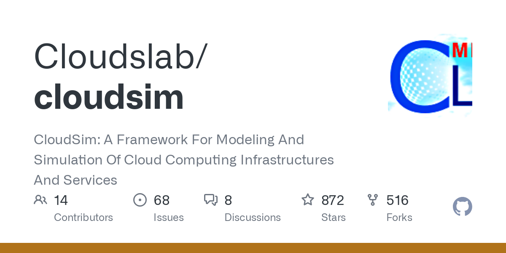
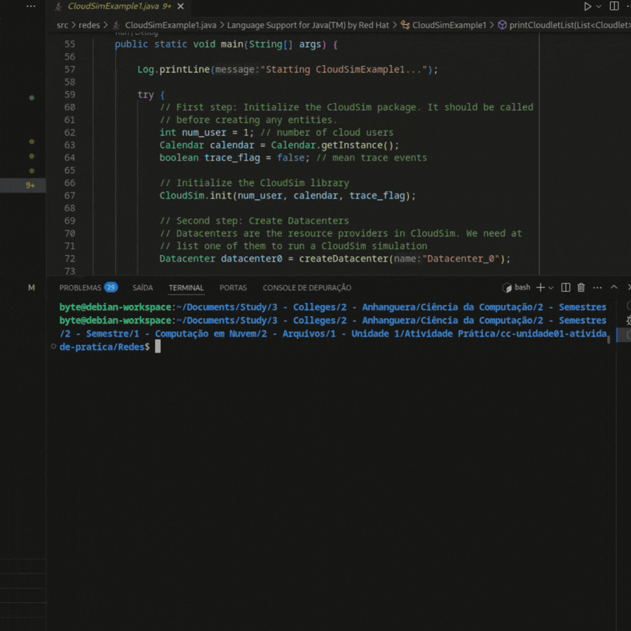

# ☁️ Simulação de Computação em Nuvem com CloudSim (Exemplo Prático)

 

    Este projeto utiliza o <strong><a href="https://github.com/Cloudslab/cloudsim">CloudSim</a></strong>, um framework extensível para modelagem e simulação de infraestruturas e serviços de computação em nuvem. O objetivo é fornecer um ambiente controlado para avaliar o desempenho de novas aplicações e políticas em nuvem antes de sua implementação real.

    

  

## ☁️ O que é a Computação em Nuvem? Como funciona o CloudSim?

 

    A computação em nuvem revolucionou o desenvolvimento e a manutenção de aplicações modernas, oferecendo escalabilidade e baixa latência. No entanto, testar e validar aplicações diretamente em ambientes de nuvem reais pode ser custoso e complexo. É nesse contexto que o CloudSim se destaca como uma ferramenta essencial.
      
    O CloudSim é uma estrutura de código aberto, desenvolvida em Java, que permite a simulação de infraestruturas e serviços de computação em nuvem. Ele foi criado pelo <strong><a href="http://clouds.cis.unimelb.edu.au/cloudsim/">CLOUDS Lab da Universidade de Melbourne</a></strong>, na Austrália, e tornou-se uma das ferramentas de simulação em nuvem mais populares na pesquisa e academia.
      
    A utilização do CloudSim contribui significativamente para a redução de custos em projetos de computação em nuvem. Ao evitar a necessidade de infraestrutura física e serviços de nuvem pagos durante as fases iniciais de desenvolvimento e teste, as organizações podem economizar recursos financeiros consideráveis. Além disso, a capacidade de identificar e mitigar problemas de desempenho antecipadamente evita gastos adicionais com retrabalho e ajustes pós-implantação.
      
    Em resumo, o CloudSim oferece uma plataforma robusta e econômica para a simulação e modelagem de ambientes de computação em nuvem, permitindo que desenvolvedores e pesquisadores avaliem suas soluções de forma eficiente antes da implementação em ambientes reais.

  

## 📊 Vantagens do Uso do CloudSim

 
✅ <strong>Custo-efetividade:</strong> Ao utilizar o CloudSim, é possível modelar e testar diferentes cenários de computação em nuvem sem a necessidade de investir em hardware ou serviços de nuvem reais. Isso elimina os custos associados à instalação, manutenção e operação de infraestruturas físicas.  

✅ <strong>Flexibilidade e Escalabilidade:</strong> O CloudSim permite ajustar facilmente os recursos simulados, como adicionar ou remover máquinas virtuais, modificar capacidades de processamento e alterar políticas de alocação. Essa flexibilidade facilita a adaptação a diferentes cenários e requisitos de pesquisa ou desenvolvimento. 
  

✅ <strong>Avaliação de Riscos Antecipada:</strong> Com a simulação, é possível identificar e resolver potenciais gargalos e problemas de desempenho antes da implantação real. Isso reduz os riscos associados a falhas em produção e garante que o sistema esteja otimizado para lidar com cargas esperadas.  

✅ <strong>Ambiente Controlado para Testes:</strong> A simulação oferece um ambiente controlado e repetível, permitindo a execução de testes rigorosos e a obtenção de resultados consistentes. Isso é especialmente útil para pesquisadores que buscam validar algoritmos e estratégias de gerenciamento de recursos em nuvem. 
  

## 📚 Dependências

 

    Para executar este projeto, você precisará dos seguintes componentes:

    🔹 <strong>Java Development Kit (JDK):</strong> Kit de Desenvolvimento Java necessário para compilar e executar o código, que você encontra no <strong><a href="https://www.oracle.com/br/java/technologies/downloads/">site official</a></strong>. 
    🔹 <strong>CloudSim:</strong> Framework de simulação para computação em nuvem. Você pode baixá-lo do <strong><a href="https://github.com/Cloudslab/cloudsim">projeto official</a></strong>.

  

## 🖥️ Configuração do Ambiente e Execução

 

    Siga os passos abaixo para configurar o ambiente e executar o projeto:

    1️⃣ <strong>Instale o JDK:</strong> Baixe e instale a versão mais recente do JDK compatível com o seu sistema operacional.  
    2️⃣ <strong>Baixe o CloudSim:</strong> Faça o download do CloudSim a partir do <strong><a href="https://github.com/Cloudslab/cloudsim">projeto oficial</a></strong> e extraia os arquivos em um diretório de sua preferência.  
    3️⃣ <strong>Configure o Projeto:</strong> Utilize uma IDE de sua preferência (por exemplo, NetBeans ou Eclipse) para criar um novo projeto Java. Adicione o arquivo JAR do CloudSim às bibliotecas do projeto para acessar as classes e métodos fornecidos pelo framework.  
    4️⃣ <strong>Adicione o Código-Fonte:</strong> Inclua o código-fonte fornecido <code>CloudSimExample1.java</code> no pacote adequado do seu projeto.  
    5️⃣ <strong>Compile e Execute:</strong> Compile o projeto e execute a classe principal para iniciar a simulação. 

  

## 🛠️ Tecnologias Utilizadas

 

    🔹 <strong>Java:</strong> Linguagem de programação principal utilizada para desenvolver a lógica do simulador. 
    🔹 <strong>CloudSim:</strong> Framework em Java para simulação de ambientes de computação em nuvem. 
    🔹 <strong>Maven:</strong> Ferramenta de automação de compilação e gerenciamento de dependências. 
    🔹 <strong>Git e GitHub:</strong> Sistema de controle de versão para gerenciamento do código-fonte e hospedagem web. 
    🔹 <strong>Visual Studio Code (VS Code)</strong> Editor de código-fonte utilizado para codificação e depuração. 

  

## 📹 Execução da Simulação e Demonstração

 

    Ao executar o projeto, o CloudSim simulará um ambiente de nuvem básico com as seguintes etapas:

    1️⃣ <strong>Inicialização:</strong> Configura o ambiente de simulação e define parâmetros iniciais. 
    2️⃣ <strong>Criação do Datacenter:</strong> Estabelece um datacenter com recursos especificados. 
    3️⃣ <strong>Criação do Broker:</strong> Instancia um broker para gerenciar VMs e cloudlets. 
    4️⃣ <strong>Configuração de VMs e Cloudlets:</strong> Define e aloca VMs e tarefas que serão executadas na simulação. 
    5️⃣ <strong>Início da Simulação:</strong> Inicia o processo de simulação e aguarda sua conclusão. 

 

  

    <strong>📢 Sinta-se à vontade para contribuir com sugestões e melhorias!</strong>  

  